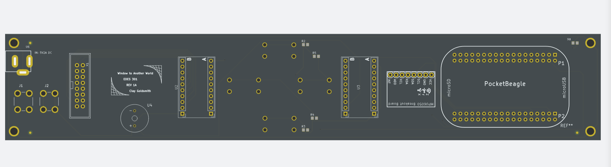

# Window to Another World

This repo contains the KiCAD Project files for my 'Window to Another World' EDES 310 PCB project.

# Project Overview

The Window is a device intended for art programs / simple games - it runs a linux system with a custom LED matrix display and connections to an IMU, a buzzer, and four buttons.

This repo contains the KiCAD project files for the full system on one chip. 

# Board Specifics

The board is a four-layer PCB with a custom design intended to be mounted directly below the LED Matrix and span the full width of the device. 

The board connects to the display via two cable ports: the 2x08 male header for our 16 data cables and the screw terminals for power and ground.

The IMU communicates via I2C, while the buzzer is driven via PWM and the buttons are simple pull-up GPIO inputs.
